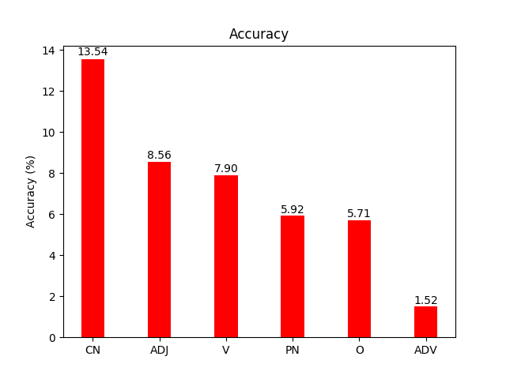

# LSTM + CONTINUOUS CACHE 
1 layer, 512 hidden size, 1 epoch + theta = 0.3, lambda (linear interpolation) = 0.7  
All perplexity and accuracy results are computed on lambada_test

### Target word PoS tag

### Target word appears in tag context

### Distance (in #words) to previous target word mentions in the context

### Number of mentions of the target word in the context

