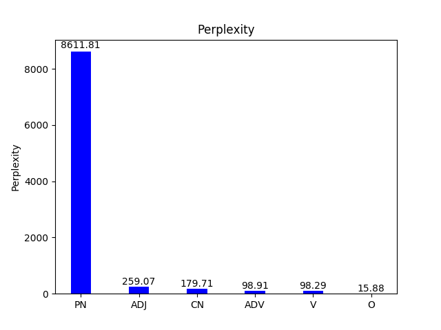
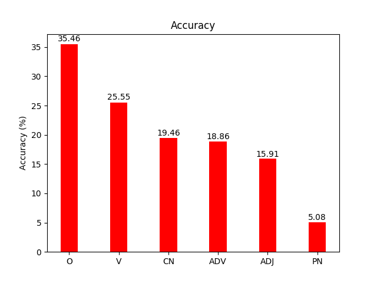
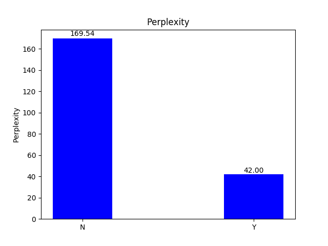
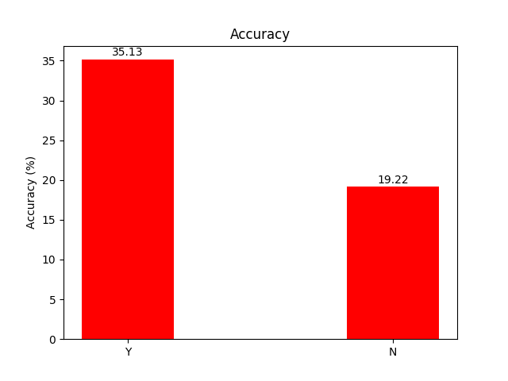
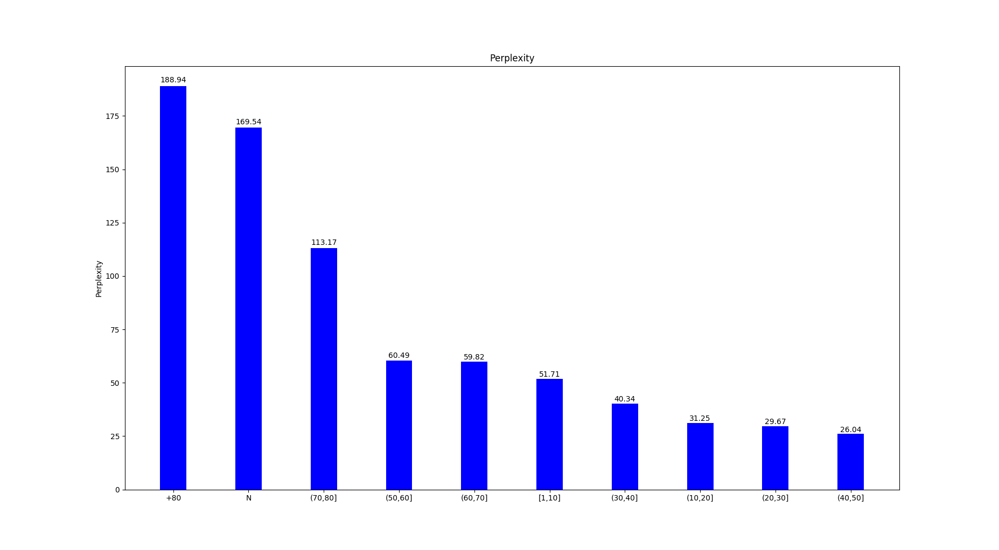
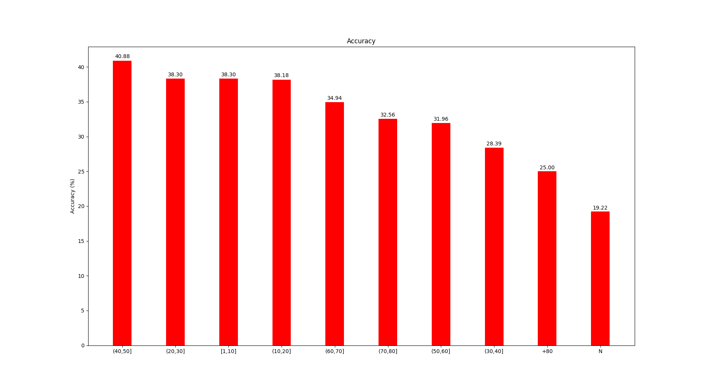
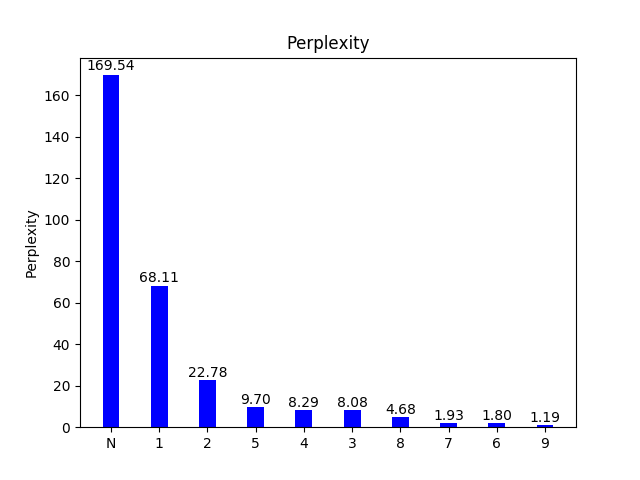
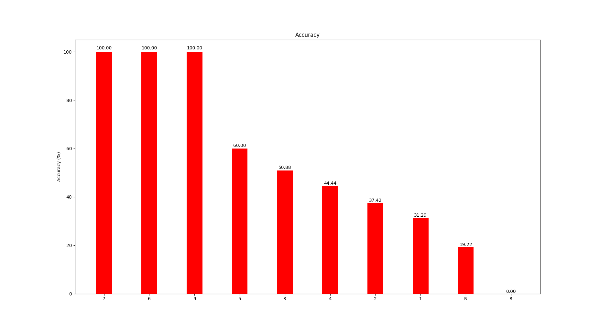

# LSTM
1 layer, 512 hidden size, 1 epoch  
All perplexity and accuracy results are computed on lambada_control  
Perplexity: 134.22, Accuracy: 21.9 %  

### Target word (or its lemma) PoS tag

|  CN  |  O   | V   | ADV | ADV | PN |
|:----:|:----:|-----|-----|-----|----|
| 2400 | 829  | 728 | 440 | 308 | 295| 

### Target word appears in the context

|  Yes |  No |
|:----:|:---:|
| 837  | 4163| 

### Distance (in #words) to previous target word mentions in the context

|  No | (30,40]| (20,30] | (40,50] | (10,20] | (50,60] | (60,70] | [1,10]  | (70,80] | +80 |
|:---:|:------:|:-------:|:-------:|:-------:|:-------:|:-------:|:-------:|:-------:|:---:|
| 4163|   155  |   141   |   137   |   110   |   97    |   83    |   47    |   43    |  24 | 

### Number of mentions of the target word in the context

|  No |   1  |  2  |  3  |  4 | 5 | +5 |
|:---:|:----:|:---:|:---:|:--:|:-:|:--:|
| 4163| 572  | 163 | 57  | 27 | 10| 8  |

