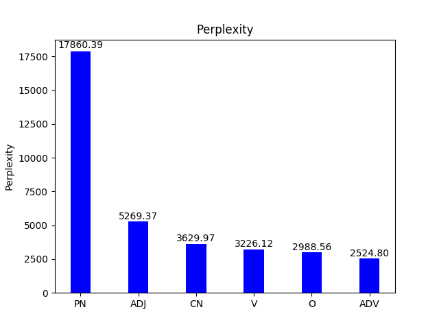
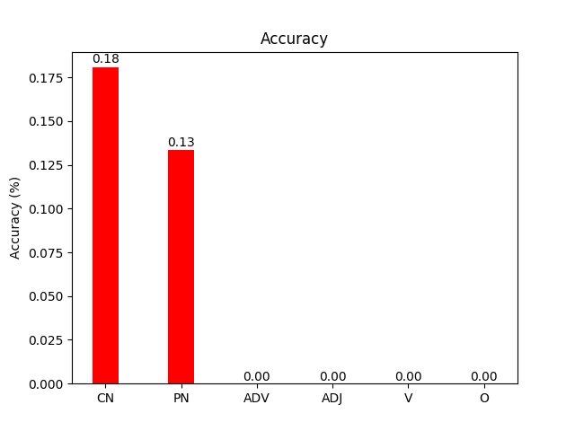
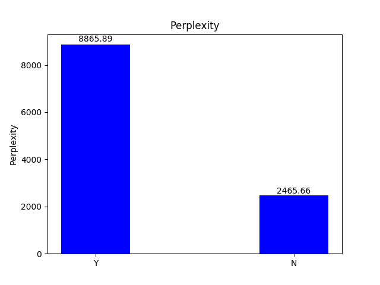
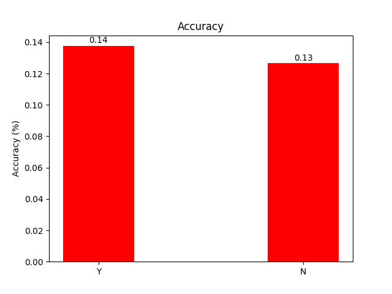
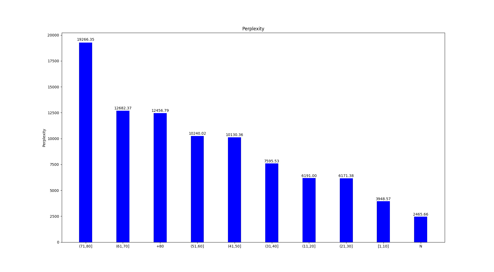
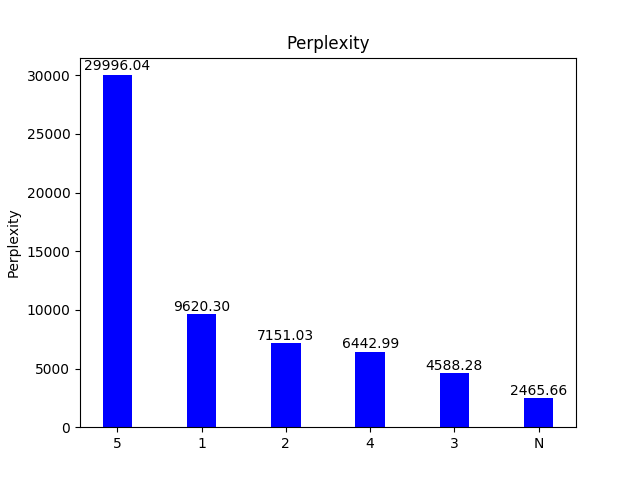
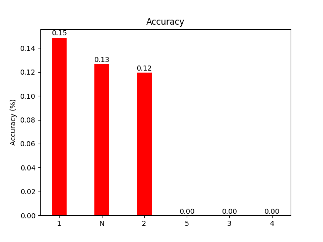

# LSTM
1 layer, 512 hidden size, 1 epoch  
All perplexity and accuracy results are computed on lambada_test  
Perplexity: 7286.43, Accuracy: 0.1 %  

### Target word (or its lemma) PoS tag

|  PN  |  CN  | V   | ADJ | ADV | O  |
|:----:|:----:|-----|-----|-----|----|
| 2248 | 2215 | 367 | 222 | 66  | 35 | 

### Target word appears in the context

|  Yes |  No |
|:----:|:---:|
| 4363 | 790 | 

### Distance (in #words) to previous target word mentions in the context

|  No | [1,10] | (10,20] | (20,30] | (30,40] | (40,50] | (50,60] | (60,70] | (70,80] | +80 |
|:---:|:------:|:-------:|:-------:|:-------:|:-------:|:-------:|:-------:|:-------:|:---:|
| 790 |   13   |   504   |   678   |   797   |   863   |   728   |   461   |   189   |  69 | 

### Number of mentions of the target word in the context

|  No |   1  |  2  |  3  |  4 | 5 |
|:---:|:----:|:---:|:---:|:--:|:-:|
| 790 | 3367 | 837 | 135 | 23 | 1 |

